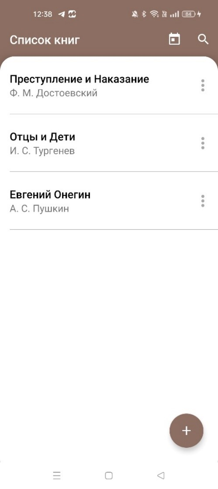
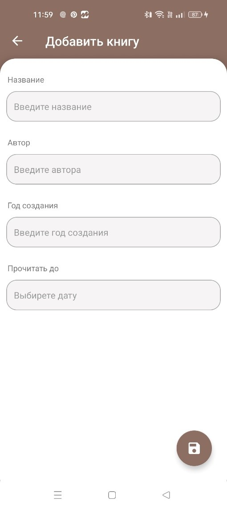
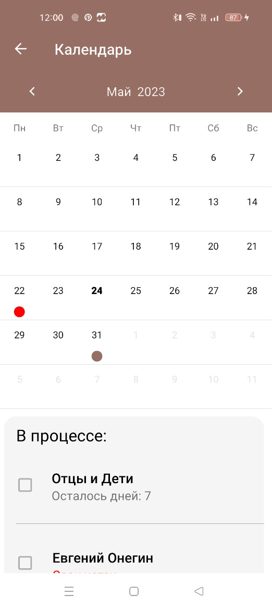
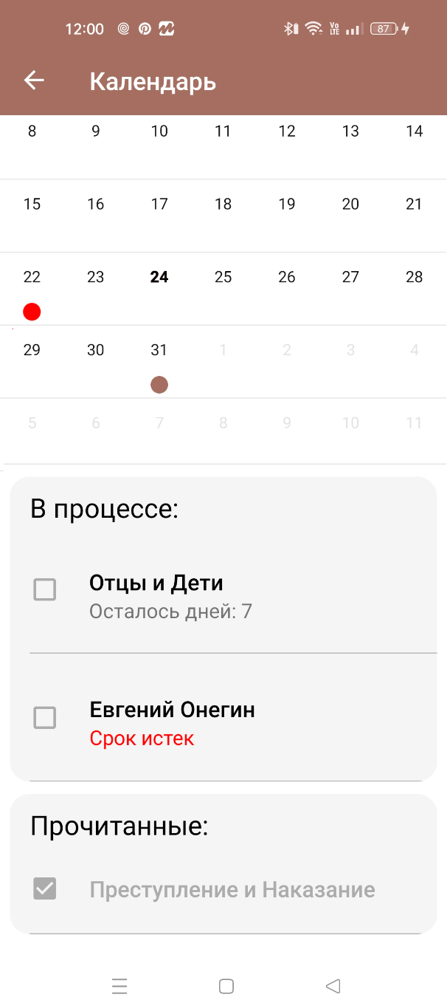
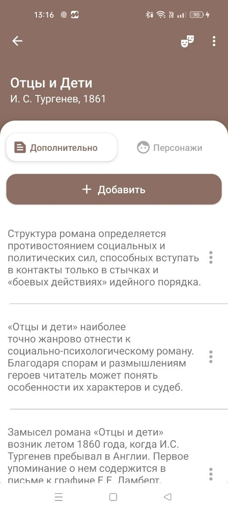
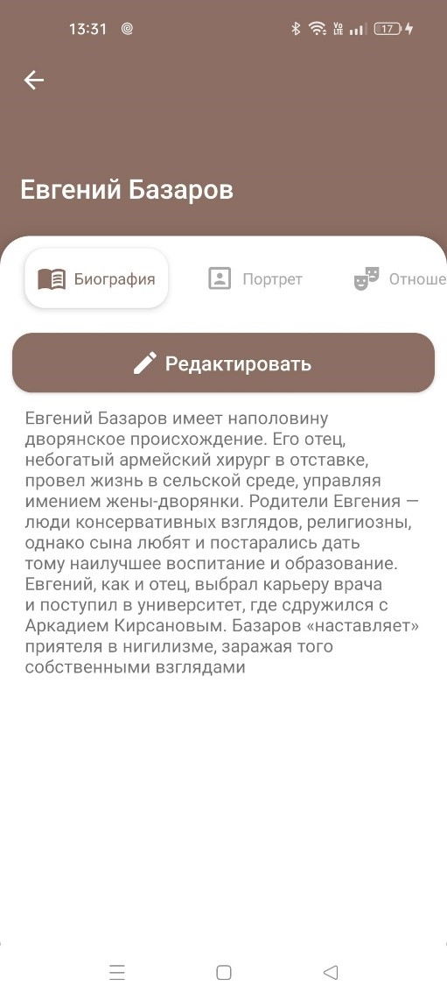
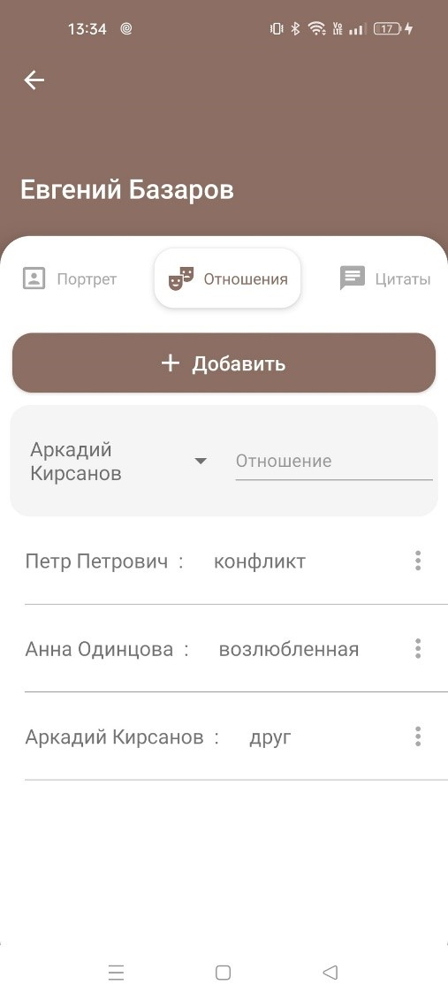
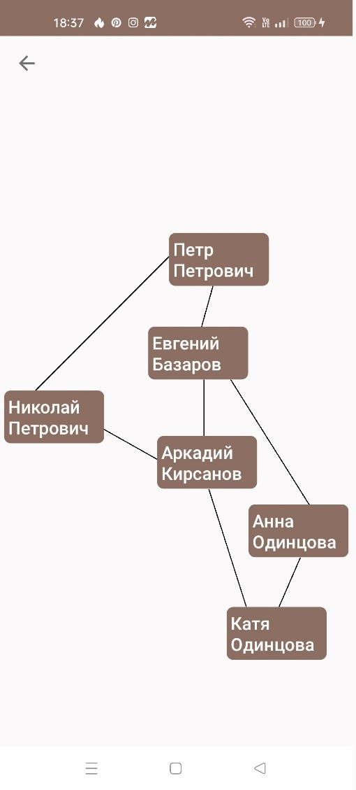

# Мобильное приложение «Помощник читателю» 
Мобильное прлиожение «Помощник читателяю» разработано для ОС Android в рамках дипломной  работы с целью позволить конечному пользователю добавлять новое произведение, редактировать информацию о произведении, добавлять персонажей и информацию о них, визуализировать отношения между персонажами и вести календарь.
## Содержание
- [Cредства реалзиации](#средства-реализации)
- [Требования к программному и аппаратному обеспечению](#требования-к-программному-и-аппаратному-обеспечению)
- [Интерфейс](#интерфейс)
- [Дополнительно](#дополнительно)

## Средства реализации
При реализации проекта использовались следующие программные средства: 
+	интегрированная среда разработки Android Studio;
+	язык программирования Kotlin;
+ СУБД SQLite;
+ библиотека [Room](https://developer.android.com/training/data-storage/room); 
+ библиотека [GraphView](https://github.com/oss-bandb/GraphView);
+	библиотека [Material CalendarView](https://github.com/Applandeo/Material-Calendar-View).

Библиотека Room является частью Android Architecture Components, библиотек, которые соответствуют рекомендациями построения архитектуры приложений Google, и предназначена для работы с базами данных SQLite. Она упрощает процесс создания запросов и работы с данным и предоставляет следующие преимущества:
+ проверка SQL-запросов во время компиляции;
+	удобные аннотации, которые минимизируют повторяющийся шаблонный код.
  
Библиотека Android GraphView используется для построения графов. С её помощью можно отображать данные в виде неориентированного графа, что решает поставленную задачу визуализации взаимоотношений персонажей. 

Библиотека Material CalendarView использована для создания пользовательского календаря. Она позволяет настраивать различные аспекты календаря, такие как цвета, шрифты, виды выделения и др. Это помогает адаптировать календарь под дизайн приложения. Библиотека позволяет отображать даты в календаре и добавлять события. Также её преимуществом является поддержка всех языков, которые поддерживаются операционной системой Android, что легко позволяет настроить календарь для русскоязычных пользователей. 

  
## Требования к программному и аппаратному обеспечению
Поскольку Android имеет открытый исходный код, фиксированных конфигураций аппаратного и программного обеспечения не существует.
Для совместимости с мобильным устройством требуется: 
+ версия операционной системы — Android 7.0 и более поздние версии;
+ 43 МБ свободного места на устройстве.

## Интерфейс
Интерфейс приложения состоит из нескольких отдельных экранов. На главном экране расположены кнопка календаря, кнопка поиска, 
список всех добавленных произведений и кнопка для добавления нового. 

При нажатии на круглую кнопку (floating action button) происходит переход на экран добавления основной информации о новом произведении. 
Экран добавления содержит в себе кнопку сохранения в нижнем правом углу экрана и четыре основных поля для заполнения: 
–	название произведения;
–	автор;
–	год создания;
–	дата, до которой запланировано прочитать произведение.

В главном экране, если нажать на иконку календаря, будет совершен переход на другой экран, который представлен на (рис. справа). 
Точками в календаре отмечены те произведения, который еще находятся в процессе чтения. Красная точка означает, что срок чтения уже просрочен. 

 

Внизу экрана находятся два списка: «в процессе» и «прочитанные». 
Список «в процессе» отображает те произведения, которые пользователь еще не отметил, как прочитанные. 
Элемент списка состоит из названия книги и количества дней до конца установленного срока прочтения. 
Если срок истек, это будет указано красным цветом текста. 
Для того, чтобы отметить произведение как прочитанное, достаточно поставить галочку в левой части элемента списка, и тогда произведение переместится в список «прочитанные». 

 

Для того, чтобы добавить или просмотреть дополнительную информацию о книге, необходимо нажать на книгу из списка, находящегося на главном экране.
После нажатия открывается экран дополнительной информации

 

Чтобы открыть полную информацию о персонаже, достаточно выбрать нужного персонажа из списка. 
Экран содержит пять радиокнопок, отвечающие за различную информацию о персонаже, которую можно добавлять, редактировать и удалять:
–	биография;
–	портрет;
–	отношения;
–	цитаты;
–	другое

 

Особого внимания заслуживает информация об отношения персонажей. 
Для того чтобы добавить взаимоотношения межу персонажами, необходимо выбрать другого персонажа из выпадающего списка на сером фоне, ввести описание отношений и нажать кнопку добавить. 

 

На основе данных, которые заполняются в разделе отношений, будет построен неориентированный граф между всеми персонажами книги, который наглядно демонстрирует связь героев между собой 

 

## Дополнительно
1. Данное приложение было разработно в рамках дипломной работы и имело реального закзчика в виде знакомой, которая учится в литературном институте. Её проблема заключалась в том, что им действительно необходимо вести заметки о прочитанном произведении и ей хотелось бы иметь эту информацию в более струтурированном виде.
2. Ранняя версия приложения была разработана на 3-м курсе в качестве курсовой работы на языке Java, и уже для диплома изменена под Kotlin.
3. Публикация научной [статьи](https://www.elibrary.ru/download/elibrary_50089071_76933877.pdf) (upd: Собакарь это моя девечья фамилия ;) )
